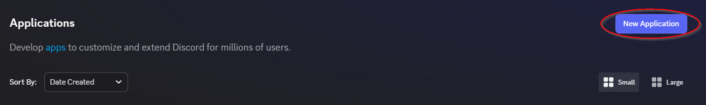
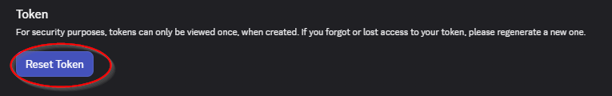
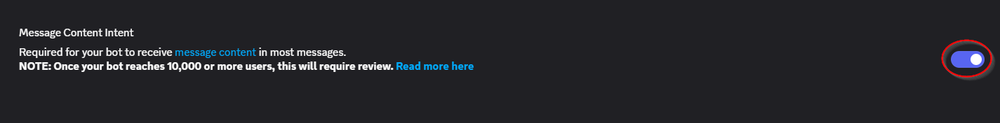
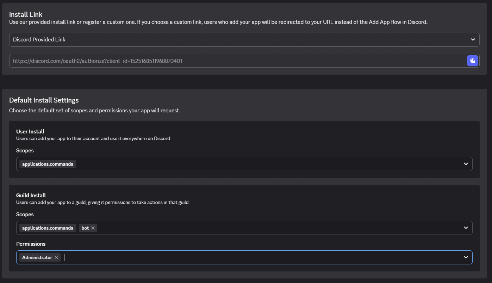
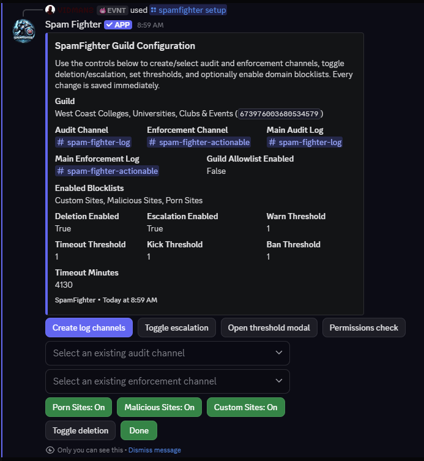
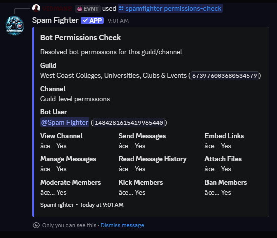

# SpamFighter

SpamFighter is a multi-guild Discord moderation bot focused on detecting and removing spam — with every global rule change gated behind human review.

- **Invite the bot:** [Click Here to Add the Bot](https://discord.com/oauth2/authorize?client_id=1484281615419965440)
- **Support / community server:** [Click Here to Join the Server](https://discord.gg/FTRwVAZ)
- **Source code:** [GitHub Source Code Link](https://github.com/west-coast-bot-bench/SpamFighter)

This repository is the sanitized public export: it contains the full bot engine and setup scaffolding, while private detector expressions, production rules, blocklists, databases, and credentials are intentionally excluded.

## Features

- **Layered spam detection**
  - Managed detector families (ticket scams, fake giveaways, "personal assistant" job scams, academic-fraud solicitation, and more) driven by regex hooks you control in `spam_rules.toml`.
  - Custom regex rules with safe-regex compilation and length limits.
  - Optional domain blocklists (`domain_blocklists/*.txt`) that can be enabled per guild.
  - Exact image matching via SHA-256 digests of attachments.
  - **Perceptual image matching (pHash)**: catches re-encoded, resized, or slightly edited copies of known spam images using 256-bit perceptual hashes and Hamming distance. The global similarity threshold defaults to 99% and is adjustable live with one admin command.
- **Escalating enforcement** — per guild, fully configurable: delete the message, count the violation, then warn → timeout → kick → ban at thresholds you choose.
- **AI-assisted rule drafting with mandatory human review** — reported spam can get an AI-drafted rule suggestion, but nothing deploys without a human approver (and AI drafts require a second approver).
- **Retroactive enforcement** — when a spam report is approved and deployed, the reported message(s) are actioned in the source server using that server's own moderation settings.
- **Retro scans** — preview (dry-run) or execute scans over recent channel history to clean up older spam with the current rules.
- **Validation gates** — before any rule deploys, it is tested against configured known-clean channels to catch false positives up front.
- **Full audit trail** — every deletion, escalation, rule change, and review decision is logged to configurable audit/enforcement channels.

## What's Customizable Per Guild

- Enable/disable message deletion and escalation independently.
- Warn / timeout / kick / ban thresholds and timeout duration.
- Audit log channel and enforcement log channel.
- Which optional domain blocklists are active.
- Disable individual SpamFighter commands or whole command groups for a guild.
- Known-clean validation channels used for pre-deployment rule testing.

Global (bot-operator level) settings include the managed rule set itself, reviewer/deployer allowlists, the AI review budget, and the perceptual image similarity threshold.

## How It Works: Reports, AI, and Human Review

1. **Anyone reports spam.** Right-click (or long-press) a message → **Apps → SpamFighter AI Report**. The report is forwarded to a private review channel for staff. No rule changes happen automatically.
2. **Duplicate reports merge.** Reports of the same or near-identical messages cluster into one review entry, with reporter reputation tracked.
3. **AI drafts, humans decide.** Staff can request an AI-drafted rule suggestion. The prompt sent to the AI is redacted and previewable (`/spamfighter preview-ai-prompt`), and the draft is only ever a *suggestion*.
4. **Validation gate.** Before deployment, the draft is tested against known-clean channels; if it matches legitimate messages, deployment is blocked.
5. **Human approval.** A human reviewer must click **Approve & Deploy**. AI-drafted rules require a second approver. Deployments are restricted to an operator allowlist.
6. **Retro-enforcement.** Once deployed, the originally reported message(s) are deleted and the author is actioned in the source server — using that server's own thresholds and toggles, with everything logged.

## Why It's Secure and Transparent

- **Open source (GPL-3.0).** The entire engine is public; you can read exactly what it does.
- **Human-in-the-loop, always.** No AI output ever changes detection behavior without explicit human approval, and global rule deployment is limited to an explicit allowlist of operators.
- **Not a new attack vector.** The bot requests only the permissions it needs, supports a guild allowlist so it only operates where invited, validates all user-supplied input server-side, and keeps every enforcement action in audit logs. Rule changes can be rolled back from automatic backups (`/sf-rules history`, `/sf-rules rollback`).
- **No secrets in the repo.** Tokens, API keys, database URLs, and private rules live in environment variables and git-ignored files. This public export ships with non-matching placeholder patterns only.
- **Per-guild control.** Server admins can disable deletion, escalation, individual commands, or the whole bot's enforcement for their guild at any time.
- **Dry-run first.** A global dry-run mode and dry-run retro scans let you see what *would* be actioned before anything is deleted.

## How False Positives Are Minimized

- **Known-clean validation channels**: every rule draft is tested against real legitimate messages before it can deploy.
- **Regression checks**: `/sf-reviews regression-check` dry-runs current rules against recent guild history.
- **Reporter reputation and cooldowns**: users whose reports are repeatedly denied are temporarily rate-limited.
- **False-positive reporting**: staff use `/sf-reviews report-false-positive` to send an incorrect match to the master review queue, optionally with an AI-drafted rule adjustment.
- **Conservative image matching**: perceptual matching defaults to 99% similarity (near-identical images only) and is tunable between 90–100%.
- **Rollback**: any deployed rule set can be reverted from timestamped backups.

## Commands for Everyone

These work for all server members — no special permissions needed:

| Command | What it does |
|---|---|
| **SpamFighter AI Report** (message context menu) | Report a spam message to the review queue. Right-click a message → Apps → SpamFighter AI Report. You get an ephemeral confirmation; staff review it privately. |
| `/spamfighter help` | Overview of what SpamFighter does and the most useful commands. |

## Admin Command Reference

All admin commands are guild-only and gated to server admins, configured super-users, or global control admins (some global operations are control-admin only). Grouped one-liners:

**`/spamfighter ...` (core)**
- `status` — runtime status, AI usage, and configuration overview.
- `setup` — guided setup dashboard for this guild.
- `guild-config` — show the effective configuration for this guild.
- `permissions-check` — verify the bot's permissions for the guild or a channel.
- `test-message` — test text against the spam detector.
- `open-reviews` — show pending spam rule reviews.
- `preview-ai-prompt` — preview the exact redacted AI prompt for a review without calling the AI.
- `set-enforcement-channel` / `set-audit-channel` — configure log channels.
- `set-escalation` / `set-thresholds` — configure escalation behavior and thresholds.
- `scanning pause` / `scanning resume` / `scanning set-deletion` — control live scanning and deletion.
- `blocklists status|enable|disable|reload|add-domain` — manage optional domain blocklists.
- `violations reset|reset-all` — manage tracked violation counters.
- `commands list|disable|enable` — per-guild command availability.
- `control add-admin|add-super-user` — manage global operator lists.
- `audit-test`, `reload-config`, `sync-commands` — operational utilities.

**`/sf-reviews ...` (review workflow)**
- `report-new` — submit external spam text into the review pipeline.
- `report-false-positive` — forward an incorrect match to the master review channel.
- `regression-check` — dry-run regression check on recent messages.
- `set-validation-channels` / `show-validation-channels` — manage known-clean validation channels.
- `set-review-channel` — set the global review channel for reports.
- `test-report` — create a synthetic review entry for testing.

**`/sf-rules ...` (rule management)**
- `list` — show managed rules (hooks, artifacts, image hashes).
- `reload` — reload rules without restarting.
- `image-similarity` — view or set the global perceptual image match threshold.
- `disable` — disable or remove a managed rule entry.
- `history` / `rollback` — list backups and restore a previous rule set.

**`/sf-retro ...` (retroactive scans)**
- `start` — preview or execute a spam scan across recent channel history.
- `validate-clean` — scan known-clean channels for potential false positives.
- `status` / `cancel` — monitor or stop a running scan.

## Setup Guide

> Screenshots referenced below live in `docs/images/`. If you're reading this before they're added, the steps still work — the images are illustrative.

### 1. Create the application

1. Go to the [Discord Developer Portal](https://discord.com/developers/applications) and create a **New Application**.
2. Under **Bot**, create the bot user and copy the token (you'll put it in `.env` — never commit it).




### 2. Enable intents

Under **Bot → Privileged Gateway Intents**, enable **Message Content Intent**.



### 3. Invite the bot

Under **OAuth2 → URL Generator**, select scopes:

```text
bot applications.commands
```

Recommended permissions for full operation:

```text
View Channels
Send Messages
Send Messages in Threads
Embed Links
Attach Files
Read Message History
Manage Messages
Moderate Members
Kick Members
Ban Members
Manage Channels
```

Put the bot's role **above** the roles it needs to timeout, kick, or ban.



### 4. Configure channels and thresholds

In your server, run:

1. `/spamfighter setup` — guided dashboard.
2. `/spamfighter set-audit-channel` and `/spamfighter set-enforcement-channel` — where actions get logged.
3. `/spamfighter set-thresholds` and `/spamfighter set-escalation` — how strict enforcement should be.
4. `/sf-reviews set-validation-channels` — pick busy, known-clean channels to validate new rules against.



### 5. Verify

- `/spamfighter permissions-check` — confirm the bot can act where it needs to.
- `/spamfighter test-message` — try a sample against the detector.
- Start in dry-run mode (see `config.example.toml`) and watch the audit channel before enabling deletion.


- BUG DISCOVERED! WILL CORRECT THIS!


## Reporting Spam (for members)

Found spam the bot missed? Right-click the message → **Apps → SpamFighter AI Report**. That's it — the message goes to the private review queue, staff review it (optionally with an AI-drafted rule), and if approved the rule deploys everywhere and the reported message is retroactively actioned.

## Self-Hosting

### What is included

- `SpamFighter.py`: bot runtime with private static spam patterns replaced by non-matching placeholders
- `requirements.txt`: Python dependencies
- `Dockerfile`: container build
- `config.example.toml`: safe configuration template
- `spam_rules.example.toml`: empty managed-rule template
- `.env.example`: environment variable template
- `compose.example.yaml`: optional Docker Compose template

### What you must provide privately

- Discord bot token
- Server and channel IDs
- Your real managed spam rules in `spam_rules.toml` (or a Postgres rules database)
- Optional domain blocklists under `domain_blocklists/`
- Optional OpenAI API key for AI-assisted rule review
- Optional Postgres database for managed rules, per-guild overrides, and global settings
- Runtime state database and report files

### Local setup

1. Create and activate a virtual environment.

```powershell
python -m venv .venv
.\.venv\Scripts\Activate.ps1
```

2. Install dependencies.

```powershell
pip install -r requirements.txt
```

3. Copy example files.

```powershell
Copy-Item .env.example .env
Copy-Item config.example.toml config.toml
Copy-Item spam_rules.example.toml spam_rules.toml
```

4. Edit `.env`, `config.toml`, and `spam_rules.toml` with your private values.

5. Start the bot.

```powershell
python SpamFighter.py
```

### Docker setup

```powershell
Copy-Item compose.example.yaml compose.yaml
Copy-Item .env.example .env
Copy-Item config.example.toml config.toml
Copy-Item spam_rules.example.toml spam_rules.toml
docker compose up --build
```

## Rule Configuration

This public export does not include useful spam signatures. Add your rules privately in `spam_rules.toml` (or via the Postgres-backed managed rules store).

The empty template supports:

- exact artifact values
- image SHA-256 hashes
- image perceptual hashes (pHash)
- hook regexes for managed detector families
- custom regex rules

Keep `spam_rules.toml`, `spam_rules_history/`, databases, and runtime reports out of git.

## Disclaimer

This repository is a sanitized public export of SpamFighter. It does not include private production regexes, managed spam rules, domain blocklists, databases, runtime reports, credentials, API keys, or deployment-specific configuration.

The included detector placeholders are intentionally incomplete and are not represented as production-ready spam protection. Anyone deploying this project is responsible for supplying their own rules, reviewing moderation behavior, configuring Discord permissions correctly, protecting secrets, and complying with Discord's Terms of Service and all applicable laws.

SpamFighter can delete messages and take moderation actions such as timeouts, kicks, or bans when configured to do so. Test in dry-run mode first and review logs before enabling enforcement in a real server.

## License

This project is licensed under the GNU General Public License v3.0. See `LICENSE` for details.

This software is provided without warranty; see the GPL-3.0 license text for the full warranty disclaimer and limitation of liability.

## Terms and Privacy

See `TERMS.md` and `PRIVACY.md` for the public SpamFighter terms and privacy policy.
